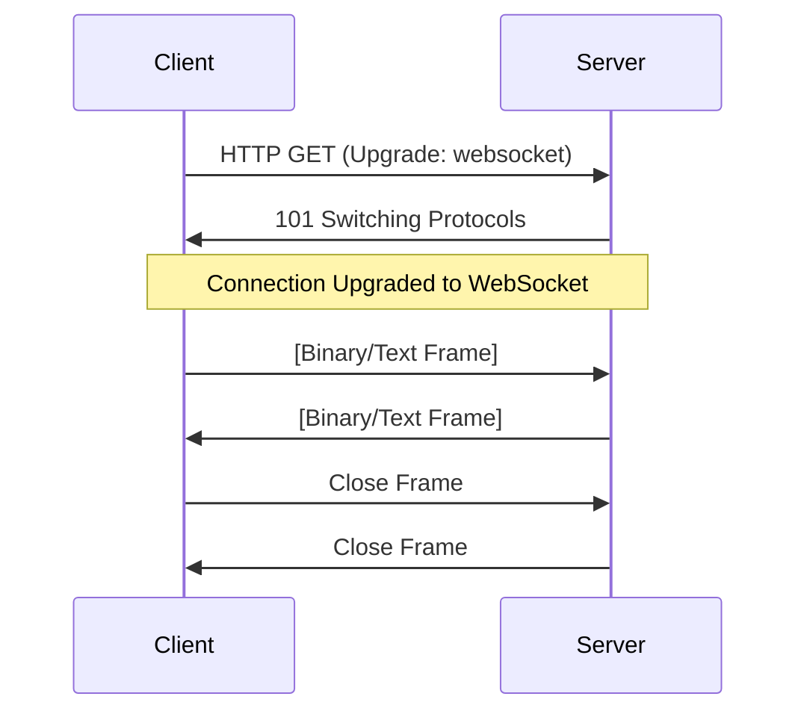

# WebSocket (WS) & Secure WebSocket (WSS) Data Flow Guide

This guide explains the mechanics of WebSocket communication, the security layer provided by WSS, and how data is transmitted between a client and a server.

---

## 1. The Handshake: From HTTP to WS

WebSockets start as a standard HTTP request. This is known as the **HTTP Upgrade** handshake.

### The Flow:
1. **Client Request**: The client sends a standard GET request with specific headers:
   - `Upgrade: websocket`
   - `Connection: Upgrade`
   - `Sec-WebSocket-Key: [Random Key]`
2. **Server Response**: If the server supports WebSockets, it responds with:
   - `HTTP/1.1 101 Switching Protocols`
   - `Upgrade: websocket`
   - `Connection: Upgrade`
   - `Sec-WebSocket-Accept: [Hashed Key]`

Once this 101 status is received, the TCP connection remains open, and the protocol switches from HTTP to WebSocket.



---

## 2. WS vs WSS: The Security Layer

| Feature | WS (WebSocket) | WSS (WebSocket Secure) |
| :--- | :--- | :--- |
| **Protocol** | `ws://` | `wss://` |
| **Port** | 80 (usually) | 443 (usually) |
| **Security** | Plaintext (Unencrypted) | Encrypted (TLS/SSL) |
| **Proxying** | Often blocked by strict firewalls | Passes through most firewalls/proxies |

### Data Flow in WSS:
In WSS, the data is wrapped in a TLS (Transport Layer Security) tunnel.
1. **TCP Handshake**: Establish connection.
2. **TLS Handshake**: Server presents certificate, encryption keys are exchanged.
3. **HTTP Upgrade**: Occurs *inside* the encrypted tunnel.
4. **Data Exchange**: All subsequent frames are encrypted.

> [!IMPORTANT]
> Always use **WSS** in production to prevent "Man-in-the-Middle" (MITM) attacks and to ensure compatibility with modern browsers which block mixed content (loading `ws://` from an `https://` page).

---

## 3. Data Transmission (Frames)

Unlike HTTP (which is Request-Response), WebSockets use **Frames**.
- **Full-Duplex**: Both client and server can send data at any time without waiting for a request.
- **Low Overhead**: Once established, frames have a very small header (2-14 bytes), making it much faster than polling.

### Message Types:
- **Text**: UTF-8 encoded strings (Common for JSON/OCPP).
- **Binary**: Raw bytes (Images, files, custom protocols).
- **Control Frames**:
  - `Ping/Pong`: Keep-alive mechanism.
  - `Close`: Gracefully terminate connection.

---

## 4. Implementation: Send & Receive

### Client-Side (JavaScript)
```javascript
// Connect to server
const socket = new WebSocket('wss://example.com/ocpp');

// Connection opened
socket.onopen = (event) => {
    console.log('Connected to server');
    // SEND DATA
    const message = JSON.js_stringify([2, "12345", "BootNotification", {}]);
    socket.send(message);
};

// RECEIVE DATA
socket.onmessage = (event) => {
    const data = JSON.parse(event.data);
    console.log('Message from server:', data);
};

// Handle errors
socket.onerror = (error) => {
    console.error('WebSocket Error:', error);
};
```

### Server-Side (Python - `websockets` library)
```python
import asyncio
import websockets

async def handler(websocket, path):
    # RECEIVE DATA
    async for message in websocket:
        print(f"Received: {message}")
        
        # SEND DATA
        response = f"Acknowledged: {message}"
        await websocket.send(response)

start_server = websockets.serve(handler, "localhost", 8765)
asyncio.get_event_loop().run_until_complete(start_server)
asyncio.get_event_loop().run_forever()
```

---

## 5. Context: OCPP over WebSockets (OCPP-J)

In this project, we use **OCPP-J (JSON over WebSockets)**.
- **Path**: Typically includes the Charge Point Identity, e.g., `wss://central-system.com/webServices/ocpp/CP_001`.
- **Subprotocol**: The client must request `ocpp1.6` or `ocpp2.0.1` in the `Sec-WebSocket-Protocol` header.

### Flow in ExxmotaicOSCCP:
1. **Charger** connects to **HAProxy**.
2. **HAProxy** terminates SSL (if WSS) and forwards the connection to the **Echo/Core Service**.
3. **Core Service** maintains the socket and routes messages to the appropriate controllers.

---

## 6. Troubleshooting
- **Handshake 403/401**: Authentication failed during upgrade.
- **Connection Reset**: Firewall or Proxy closed the idle connection (use Pings).
- **Protocol Error**: Subprotocol mismatch or invalid frame format.
